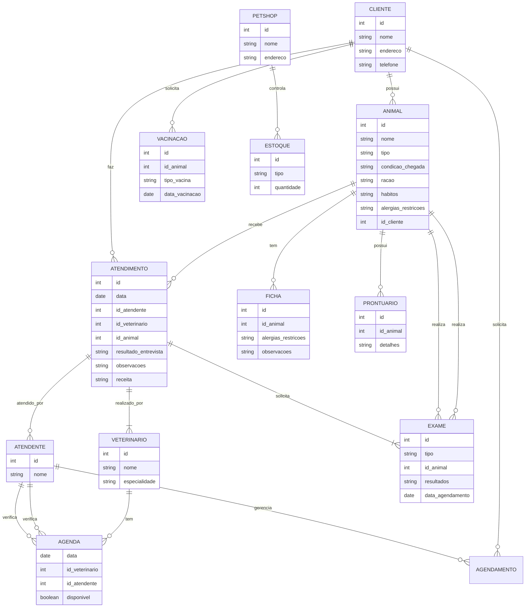
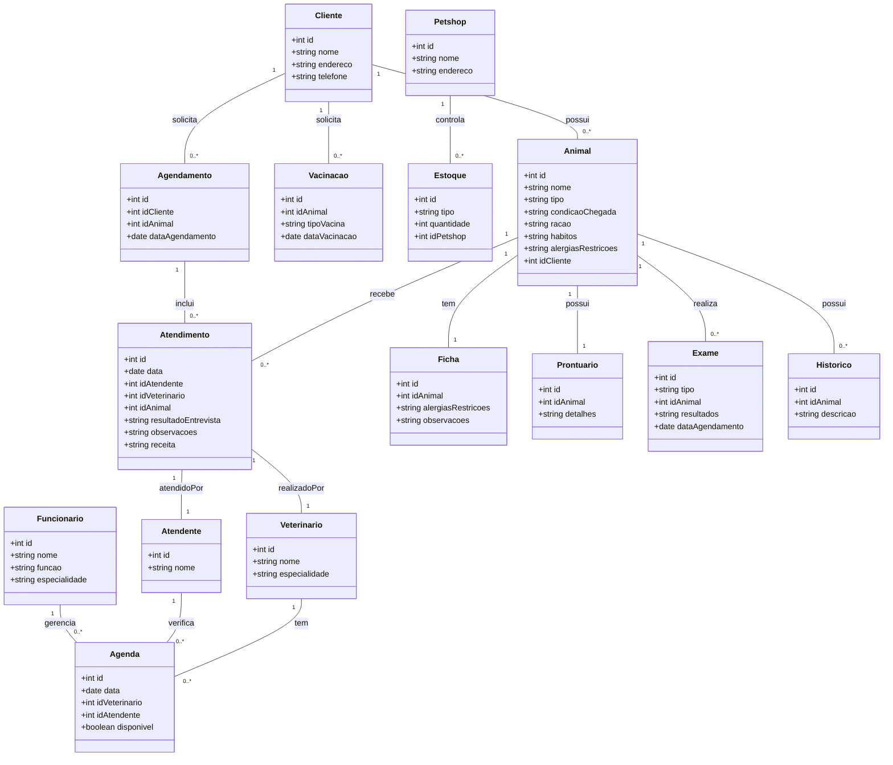

# Vitor_Emanuel
---

- [Vitor\_Emanuel](#vitor_emanuel)
- [1. Introdução](#1-introdução)
- [2. Descrição do negócio](#2-descrição-do-negócio)
- [3. Visão geral do sistema](#3-visão-geral-do-sistema)
- [4. Diagrama ER](#4-diagrama-er)
- [5. Diagrama de classes](#5-diagrama-de-classes)
- [6. Casos de uso](#6-casos-de-uso)
  - [6.1 Histórias de usuário](#61-histórias-de-usuário)
- [7. Diagrama de componentes](#7-diagrama-de-componentes)
- [8. Diagrama de implantação](#8-diagrama-de-implantação)
- [9. Protótipo de telas](#9-protótipo-de-telas)
- [10. Diagrama de navegação de telas](#10-diagrama-de-navegação-de-telas)
- [11. Pilha tecnológica](#11-pilha-tecnológica)
- [12. Requisitos de sistemas](#12-requisitos-de-sistemas)
- [13. Considerações sobre segurança](#13-considerações-sobre-segurança)
- [14. Manutenção e instalação](#14-manutenção-e-instalação)
- [15. Glossário](#15-glossário)
- [16. Script SQL](#16-script-sql)
  - [16.1 Script para criar as tabelas](#161-script-para-criar-as-tabelas)
  - [16.2 Scrip para inserir dados fictícios](#162-scrip-para-inserir-dados-fictícios)


# 1. Introdução

O projeto a seguir apresenta um sistema desenvolvido para uma petshop. A empresa é considerada uma microempresa e iniciou as atividades recentemente. Ao possuir serviços exclusivos, os sistemas presentes no mercado não se enquadra, desta forma, os proprietários decidiram desenvolver uma solução própria. Esta solução é detalhada a seguir

---
# 2. Descrição do negócio
Descrição do cenário onde o sistema deverá funcionar:
1. Uma clínica veterinária atende apenas os animais: gatos e cachorros.
2. Os clientes devem fazer um cadastro de si e dos animais.
3. Os clientes devem informar as condições nas quais os animais chegam.
4. Os clientes devem informar o tipo de ração que o animal come.
5. O cliente deve informar hábitos do animal.
6. Para cada animal é possível que mais de um veterinário o atenda.
7. Os animais podem chegar e serem atendidos de acordo com uma agenda do dia.
8. Cada animal atendido receberá uma ficha e um prontuário.
9.  Outros dono podem querer marcar horários de atendimento futuro.
10. O atendimento gera uma receita para o animal.
11. Quando um cliente chega na clínica veterinária ele é atendido por um atendente.
12. O atendente deve verificar se existe agenda disponível com um veterinário.
13. O atendente deve colocar o cliente e seu animal na fila de espera, se for o caso.
14. O atendente deve levar o cliente e o animal até o veterinário.
15. O veterinário deve realizar uma entrevista com o dono do animal.
16. O resultado da entrevista deve ir para um formulário.
17. O veterinário deverá examinar o animal e anotar em prontuário(ficha) suas observações.
18. Dependendo da situação do animal este receberá uma receita.
19. Dependendo da situação do animal, o veterinário pode solicitar exames complementares, como exames de sangue e radiografias. Esses exames devem ser registrados no prontuário do animal e uma agenda específica para exames deve ser gerenciada.
20. O cliente pode solicitar o agendamento de horário.
21. Um cliente pode desejar cancelar ou remarcar uma consulta previamente agendada. O sistema deve permitir que o atendente faça essa alteração na agenda.
22. A ficha do animal deve conter alergias ou restrições alimentares que o animal possa ter, garantindo que o veterinário tenha essas informações no momento da consulta.
23. O cliente pode solicitar a vacinação de seu pet.
24. A clínica avisa os clientes quando um animal estiver próximo do prazo para tomar uma vacina de reforço ou realizar algum procedimento periódico.
25. A petshop pode marcar os animais com RFID.
26. A petshop oferece serviços de banho e tosa.
27. A petshop vende rações e medicamentos para cães e gatos.
28. A petshop controla o estoque de medicamentos e rações usados na clínica. Quando o veterinário prescreve um medicamento ou ração especial, isso deve ser registrado e o estoque atualizado automaticamente.
29. Cada animal deve ter um histórico detalhado de todas as consultas, exames, receitas e tratamentos realizados, com a possibilidade de o cliente acessar essas informações, se autorizado.
30. Novos veterinários ou funcionários da clínica podem ser cadastrados, associando as especialidades e funções de cada um para facilitar o agendamento e a triagem de casos.


---
# 3. Visão geral do sistema
Descrição do sistema e suas relações

---
# 4. Diagrama ER
```
bloco
```


---
# 5. Diagrama de classes

---
# 6. Casos de uso

## 6.1 Histórias de usuário

---
# 7. Diagrama de componentes

---
# 8. Diagrama de implantação

---
# 9. Protótipo de telas

---
# 10. Diagrama de navegação de telas

---
# 11. Pilha tecnológica

---
# 12. Requisitos de sistemas

---
# 13. Considerações sobre segurança

---
# 14. Manutenção e instalação

---
# 15. Glossário

---
# 16. Script SQL

## 16.1 Script para criar as tabelas
```SQL
-- Criação da tabela CLIENTE
CREATE TABLE CLIENTE (
    id INT AUTO_INCREMENT PRIMARY KEY,
    nome VARCHAR(100) NOT NULL,
    endereco VARCHAR(255),
    telefone VARCHAR(20)
);

-- Criação da tabela ANIMAL
CREATE TABLE ANIMAL (
    id INT AUTO_INCREMENT PRIMARY KEY,
    nome VARCHAR(100) NOT NULL,
    tipo ENUM('Gato', 'Cachorro') NOT NULL,
    condicao_chegada TEXT,
    racao VARCHAR(100),
    habitos TEXT,
    alergias_restricoes TEXT,
    id_cliente INT,
    FOREIGN KEY (id_cliente) REFERENCES CLIENTE(id)
);

-- Criação da tabela VETERINARIO
CREATE TABLE VETERINARIO (
    id INT AUTO_INCREMENT PRIMARY KEY,
    nome VARCHAR(100) NOT NULL,
    especialidade VARCHAR(100)
);

-- Criação da tabela ATENDENTE
CREATE TABLE ATENDENTE (
    id INT AUTO_INCREMENT PRIMARY KEY,
    nome VARCHAR(100) NOT NULL
);

-- Criação da tabela ATENDIMENTO
CREATE TABLE ATENDIMENTO (
    id INT AUTO_INCREMENT PRIMARY KEY,
    data DATE NOT NULL,
    id_atendente INT,
    id_veterinario INT,
    id_animal INT,
    resultado_entrevista TEXT,
    observacoes TEXT,
    receita TEXT,
    FOREIGN KEY (id_atendente) REFERENCES ATENDENTE(id),
    FOREIGN KEY (id_veterinario) REFERENCES VETERINARIO(id),
    FOREIGN KEY (id_animal) REFERENCES ANIMAL(id)
);

-- Criação da tabela FICHA
CREATE TABLE FICHA (
    id INT AUTO_INCREMENT PRIMARY KEY,
    id_animal INT,
    alergias_restricoes TEXT,
    observacoes TEXT,
    FOREIGN KEY (id_animal) REFERENCES ANIMAL(id)
);

-- Criação da tabela PRONTUARIO
CREATE TABLE PRONTUARIO (
    id INT AUTO_INCREMENT PRIMARY KEY,
    id_animal INT,
    detalhes TEXT,
    FOREIGN KEY (id_animal) REFERENCES ANIMAL(id)
);

-- Criação da tabela EXAME
CREATE TABLE EXAME (
    id INT AUTO_INCREMENT PRIMARY KEY,
    tipo VARCHAR(100),
    id_animal INT,
    resultados TEXT,
    data_agendamento DATE,
    FOREIGN KEY (id_animal) REFERENCES ANIMAL(id)
);

-- Criação da tabela AGENDA
CREATE TABLE AGENDA (
    id INT AUTO_INCREMENT PRIMARY KEY,
    data DATE NOT NULL,
    id_veterinario INT,
    id_atendente INT,
    disponivel BOOLEAN NOT NULL DEFAULT TRUE,
    FOREIGN KEY (id_veterinario) REFERENCES VETERINARIO(id),
    FOREIGN KEY (id_atendente) REFERENCES ATENDENTE(id)
);

-- Criação da tabela VACINACAO
CREATE TABLE VACINACAO (
    id INT AUTO_INCREMENT PRIMARY KEY,
    id_animal INT,
    tipo_vacina VARCHAR(100),
    data_vacinacao DATE,
    FOREIGN KEY (id_animal) REFERENCES ANIMAL(id)
);

-- Criação da tabela PETSHOP
CREATE TABLE PETSHOP (
    id INT AUTO_INCREMENT PRIMARY KEY,
    nome VARCHAR(100) NOT NULL,
    endereco VARCHAR(255)
);

-- Criação da tabela ESTOQUE
CREATE TABLE ESTOQUE (
    id INT AUTO_INCREMENT PRIMARY KEY,
    tipo ENUM('Medicamento', 'Racao') NOT NULL,
    quantidade INT NOT NULL,
    id_petshop INT,
    FOREIGN KEY (id_petshop) REFERENCES PETSHOP(id)
);

-- Criação da tabela AGENDAMENTO
CREATE TABLE AGENDAMENTO (
    id INT AUTO_INCREMENT PRIMARY KEY,
    id_cliente INT,
    id_animal INT,
    data_agendamento DATE NOT NULL,
    FOREIGN KEY (id_cliente) REFERENCES CLIENTE(id),
    FOREIGN KEY (id_animal) REFERENCES ANIMAL(id)
);

-- Criação da tabela HISTORICO
CREATE TABLE HISTORICO (
    id INT AUTO_INCREMENT PRIMARY KEY,
    id_animal INT,
    descricao TEXT,
    FOREIGN KEY (id_animal) REFERENCES ANIMAL(id)
);

-- Criação da tabela FUNCIONARIO
CREATE TABLE FUNCIONARIO (
    id INT AUTO_INCREMENT PRIMARY KEY,
    nome VARCHAR(100) NOT NULL,
    funcao VARCHAR(100),
    especialidade VARCHAR(100)
);
```

## 16.2 Scrip para inserir dados fictícios
```SQL
-- Inserindo dados na tabela CLIENTE
INSERT INTO CLIENTE (nome, endereco, telefone) VALUES 
('João Silva', 'Rua das Flores, 123', '123456789'),
('Maria Oliveira', 'Av. das Palmeiras, 456', '987654321');

-- Inserindo dados na tabela ANIMAL
INSERT INTO ANIMAL (nome, tipo, condicao_chegada, racao, habitos, alergias_restricoes, id_cliente) VALUES 
('Fido', 'Cachorro', 'Queimadura leve', 'Ração Premium', 'Gosta de brincar', 'Nenhuma', 1),
('Miau', 'Gato', 'Dor abdominal', 'Ração Gourmet', 'Dormir o dia todo', 'Alergia a peixe', 2);

-- Inserindo dados na tabela VETERINARIO
INSERT INTO VETERINARIO (nome, especialidade) VALUES 
('Dr. Carlos Souza', 'Dermatologia'),
('Dra. Ana Lima', 'Cardiologia');

-- Inserindo dados na tabela ATENDENTE
INSERT INTO ATENDENTE (nome) VALUES 
('Pedro Santos'),
('Juliana Costa');

-- Inserindo dados na tabela ATENDIMENTO
INSERT INTO ATENDIMENTO (data, id_atendente, id_veterinario, id_animal, resultado_entrevista, observacoes, receita) VALUES 
('2024-09-10', 1, 1, 1, 'Bom estado geral', 'Queimadura leve, usar pomada', 'Pomada anti-inflamatória'),
('2024-09-11', 2, 2, 2, 'Dor abdominal leve', 'Alergia alimentar, prescrever dieta especial', 'Dieta hipoalergênica');

-- Inserindo dados na tabela FICHA
INSERT INTO FICHA (id_animal, alergias_restricoes, observacoes) VALUES 
(1, 'Nenhuma', 'Nenhuma observação adicional'),
(2, 'Alergia a peixe', 'Deve seguir dieta especial');

-- Inserindo dados na tabela PRONTUARIO
INSERT INTO PRONTUARIO (id_animal, detalhes) VALUES 
(1, 'Queimadura leve tratada com pomada. Seguimento em uma semana.'),
(2, 'Dor abdominal tratada com dieta especial. Acompanhar resposta ao tratamento.');

-- Inserindo dados na tabela EXAME
INSERT INTO EXAME (tipo, id_animal, resultados, data_agendamento) VALUES 
('Exame de sangue', 2, 'Resultados normais', '2024-09-12'),
('Radiografia', 1, 'Queimadura superficial', '2024-09-13');

-- Inserindo dados na tabela AGENDA
INSERT INTO AGENDA (data, id_veterinario, id_atendente, disponivel) VALUES 
('2024-09-10', 1, 1, TRUE),
('2024-09-11', 2, 2, TRUE);

-- Inserindo dados na tabela VACINACAO
INSERT INTO VACINACAO (id_animal, tipo_vacina, data_vacinacao) VALUES 
(1, 'Vacina contra raiva', '2024-09-15'),
(2, 'Vacina polivalente', '2024-09-16');

-- Inserindo dados na tabela PETSHOP
INSERT INTO PETSHOP (nome, endereco) VALUES 
('PetShop Animal Feliz', 'Rua das Pet Shops, 789'),
('PetShop Mundo Pet', 'Av. dos Animais, 123');

-- Inserindo dados na tabela ESTOQUE
INSERT INTO ESTOQUE (tipo, quantidade, id_petshop) VALUES 
('Medicamento', 50, 1),
('Racao', 100, 2);

-- Inserindo dados na tabela AGENDAMENTO
INSERT INTO AGENDAMENTO (id_cliente, id_animal, data_agendamento) VALUES 
(1, 1, '2024-09-10'),
(2, 2, '2024-09-11');

-- Inserindo dados na tabela HISTORICO
INSERT INTO HISTORICO (id_animal, descricao) VALUES 
(1, 'Consulta inicial com Dr. Carlos Souza. Prescrita pomada para queimadura.'),
(2, 'Consulta com Dra. Ana Lima. Dieta especial prescrita para alergia alimentar.');

-- Inserindo dados na tabela FUNCIONARIO
INSERT INTO FUNCIONARIO (nome, funcao, especialidade) VALUES 
('Ricardo Almeida', 'Recepcionista', 'Atendimento ao cliente'),
('Fernanda Dias', 'Veterinária', 'Cirurgia geral');
```