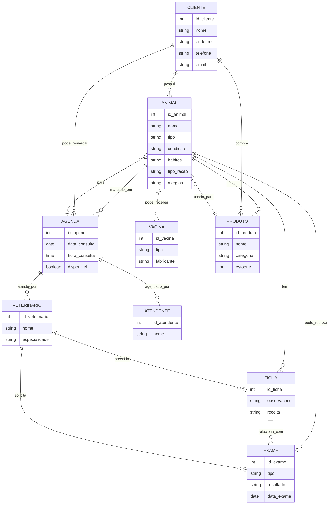
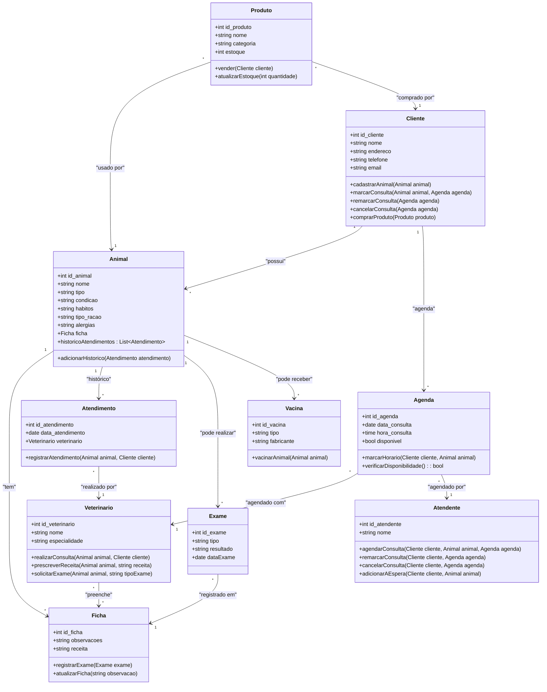

# Vitor_Emanuel
---

- [Vitor\_Emanuel](#vitor_emanuel)
- [1. Introdução](#1-introdução)
- [2. Descrição do negócio](#2-descrição-do-negócio)
- [3. Visão geral do sistema](#3-visão-geral-do-sistema)
- [4. Diagrama ER](#4-diagrama-er)
- [5. Diagrama de classes](#5-diagrama-de-classes)
- [6. Casos de uso](#6-casos-de-uso)
  - [6.1 Diagrama de Casos de Uso](#61-diagrama-de-casos-de-uso)
  - [6.2 Histórias de Usuário - Clínica Veterinária](#62-histórias-de-usuário---clínica-veterinária)
    - [1. Cadastro de Animais Permitidos](#1-cadastro-de-animais-permitidos)
    - [2. Cadastro de Clientes e Animais](#2-cadastro-de-clientes-e-animais)
    - [3. Informar Condições de Chegada do Animal](#3-informar-condições-de-chegada-do-animal)
    - [4. Informar Tipo de Ração](#4-informar-tipo-de-ração)
    - [5. Informar Hábitos do Animal](#5-informar-hábitos-do-animal)
    - [6. Atendimento por Múltiplos Veterinários](#6-atendimento-por-múltiplos-veterinários)
    - [7. Atendimentos Agendados](#7-atendimentos-agendados)
    - [8. Ficha e Prontuário do Animal](#8-ficha-e-prontuário-do-animal)
    - [9. Marcação de Horários Futuros](#9-marcação-de-horários-futuros)
    - [10. Receita Gerada Após Atendimento](#10-receita-gerada-após-atendimento)
    - [11. Atendimento por Atendente](#11-atendimento-por-atendente)
    - [12. Verificação de Disponibilidade na Agenda](#12-verificação-de-disponibilidade-na-agenda)
    - [13. Inserção em Fila de Espera](#13-inserção-em-fila-de-espera)
    - [14. Encaminhamento para o Veterinário](#14-encaminhamento-para-o-veterinário)
    - [15. Entrevista com o Dono do Animal](#15-entrevista-com-o-dono-do-animal)
    - [16. Formulário de Entrevista](#16-formulário-de-entrevista)
    - [17. Exame do Animal e Observações](#17-exame-do-animal-e-observações)
    - [18. Emissão de Receita](#18-emissão-de-receita)
    - [19. Solicitação de Exames Complementares](#19-solicitação-de-exames-complementares)
    - [20. Agendamento de Horário](#20-agendamento-de-horário)
    - [21. Cancelamento ou Remarcação de Consulta](#21-cancelamento-ou-remarcação-de-consulta)
    - [22. Registro de Alergias ou Restrições Alimentares](#22-registro-de-alergias-ou-restrições-alimentares)
    - [23. Solicitação de Vacinação](#23-solicitação-de-vacinação)
    - [24. Programa de Fidelidade](#24-programa-de-fidelidade)
    - [25. Identificação de Animais com RFID](#25-identificação-de-animais-com-rfid)
    - [26. Serviços de Banho e Tosa](#26-serviços-de-banho-e-tosa)
    - [27. Venda de Rações e Medicamentos](#27-venda-de-rações-e-medicamentos)
    - [28. Controle de Estoque de Medicamentos](#28-controle-de-estoque-de-medicamentos)
    - [29. Histórico de Atendimento e Exames](#29-histórico-de-atendimento-e-exames)
    - [30. Parcerias com Pet Shops e Laboratórios](#30-parcerias-com-pet-shops-e-laboratórios)
- [7. Diagrama de componentes](#7-diagrama-de-componentes)
- [8. Diagrama de implantação](#8-diagrama-de-implantação)
- [9. Protótipo de telas](#9-protótipo-de-telas)
  - [9.1. Tela Menu](#91-tela-menu)
  - [9.2. Telas de Cadastro](#92-telas-de-cadastro)
    - [9.2.1 Cadastro de](#921-cadastro-de)
    - [9.2.2 Cadastro de](#922-cadastro-de)
    - [9.2.3 Cadastro de](#923-cadastro-de)
    - [9.2.4 Cadastro de](#924-cadastro-de)
    - [9.2.5 Cadastro de](#925-cadastro-de)
    - [9.2.6 Cadastro de](#926-cadastro-de)
    - [9.2.7 Cadastro de](#927-cadastro-de)
    - [9.2.8 Cadastro de](#928-cadastro-de)
    - [9.2.9 Cadastro de](#929-cadastro-de)
    - [9.2.10 Cadastro de](#9210-cadastro-de)
    - [9.2.11 Cadastro de](#9211-cadastro-de)
    - [9.2.12 Cadastro de](#9212-cadastro-de)
    - [9.2.13 Cadastro de](#9213-cadastro-de)
  - [9.3 Telas de Gráficos](#93-telas-de-gráficos)
    - [9.3.1 Gráfico de Estoque](#931-gráfico-de-estoque)
    - [9.3.1 Gráfico de Vendas](#931-gráfico-de-vendas)
  - [9.4 Tela de Dashboard](#94-tela-de-dashboard)
- [10. Diagrama de navegação de telas](#10-diagrama-de-navegação-de-telas)
- [11. Pilha tecnológica](#11-pilha-tecnológica)
- [12. Requisitos de sistemas](#12-requisitos-de-sistemas)
- [13. Considerações sobre segurança](#13-considerações-sobre-segurança)
- [14. Manutenção e instalação](#14-manutenção-e-instalação)
- [15. Glossário](#15-glossário)
- [16. Script SQL](#16-script-sql)
  - [16.1 Script para criar as tabelas](#161-script-para-criar-as-tabelas)
  - [16.2 Scrip para inserir dados fictícios](#162-scrip-para-inserir-dados-fictícios)


# 1. Introdução

O projeto a seguir apresenta um sistema desenvolvido para uma petshop. A empresa é considerada uma microempresa e iniciou as atividades recentemente. Ao possuir serviços exclusivos, os sistemas presentes no mercado não se enquadra, desta forma, os proprietários decidiram desenvolver uma solução própria. Esta solução é detalhada a seguir

---
# 2. Descrição do negócio
Descrição do cenário onde o sistema deverá funcionar:
1. Uma clínica veterinária atende apenas os animais: gatos e cachorros.
2. Os clientes devem fazer um cadastro de si e dos animais.
3. Os clientes devem informar as condições nas quais os animais chegam.
4. Os clientes devem informar o tipo de ração que o animal come.
5. O cliente deve informar hábitos do animal.
6. Para cada animal é possível que mais de um veterinário o atenda.
7. Os animais podem chegar e serem atendidos de acordo com uma agenda do dia.
8. Cada animal atendido receberá uma ficha e um prontuário.
9.  Outros dono podem querer marcar horários de atendimento futuro.
10. O atendimento gera uma receita para o animal.
11. Quando um cliente chega na clínica veterinária ele é atendido por um atendente.
12. O atendente deve verificar se existe agenda disponível com um veterinário.
13. O atendente deve colocar o cliente e seu animal na fila de espera, se for o caso.
14. O atendente deve levar o cliente e o animal até o veterinário.
15. O veterinário deve realizar uma entrevista com o dono do animal.
16. O resultado da entrevista deve ir para um formulário.
17. O veterinário deverá examinar o animal e anotar em prontuário(ficha) suas observações.
18. Dependendo da situação do animal este receberá uma receita.
19. Dependendo da situação do animal, o veterinário pode solicitar exames complementares, como exames de sangue e radiografias. Esses exames devem ser registrados no prontuário do animal e uma agenda específica para exames deve ser gerenciada.
20. O cliente pode solicitar o agendamento de horário.
21. Um cliente pode desejar cancelar ou remarcar uma consulta previamente agendada. O sistema deve permitir que o atendente faça essa alteração na agenda.
22. A ficha do animal deve conter alergias ou restrições alimentares que o animal possa ter, garantindo que o veterinário tenha essas informações no momento da consulta.
23. O cliente pode solicitar a vacinação de seu pet.
24. A clínica avisa os clientes quando um animal estiver próximo do prazo para tomar uma vacina de reforço ou realizar algum procedimento periódico.
25. A petshop pode marcar os animais com RFID.
26. A petshop oferece serviços de banho e tosa.
27. A petshop vende rações e medicamentos para cães e gatos.
28. A petshop controla o estoque de medicamentos e rações usados na clínica. Quando o veterinário prescreve um medicamento ou ração especial, isso deve ser registrado e o estoque atualizado automaticamente.
29. Cada animal deve ter um histórico detalhado de todas as consultas, exames, receitas e tratamentos realizados, com a possibilidade de o cliente acessar essas informações, se autorizado.
30. Novos veterinários ou funcionários da clínica podem ser cadastrados, associando as especialidades e funções de cada um para facilitar o agendamento e a triagem de casos.


---
# 3. Visão geral do sistema
Descrição do sistema e suas relações

---
# 4. Diagrama ER


---
# 5. Diagrama de classes

---

# 6. Casos de uso

## 6.1 Diagrama de Casos de Uso


## 6.2 Histórias de Usuário - Clínica Veterinária
:bulb: **Dica** Situações de utilização  

### 1. Cadastro de Animais Permitidos
```
**Como** uma clínica veterinária,  
**Eu quero** atender apenas gatos e cachorros,  
**Para** garantir que os serviços oferecidos sejam especializados para esses tipos de animais.
```

### 2. Cadastro de Clientes e Animais
```
**Como** cliente,  
**Eu quero** fazer o cadastro de meus dados pessoais e dos meus animais,  
**Para** poder agendar consultas e utilizar os serviços da clínica.
```

### 3. Informar Condições de Chegada do Animal
```
**Como** cliente,  
**Eu quero** informar as condições em que meu animal chegou à clínica,  
**Para** que o veterinário saiba como o animal estava ao chegar.
```

### 4. Informar Tipo de Ração
```
**Como** cliente,  
**Eu quero** informar o tipo de ração que meu animal consome,  
**Para** garantir que o veterinário tenha essa informação no histórico do animal.
```

### 5. Informar Hábitos do Animal
```
**Como** cliente,  
**Eu quero** informar os hábitos do meu animal,  
**Para** que o veterinário tenha uma visão completa do comportamento do pet.
```

### 6. Atendimento por Múltiplos Veterinários
```
**Como** administrador da clínica,  
**Eu quero** que um animal possa ser atendido por mais de um veterinário,  
**Para** garantir uma avaliação completa do estado de saúde do pet.
```

### 7. Atendimentos Agendados
```
**Como** administrador da clínica,  
**Eu quero** organizar os atendimentos de acordo com a agenda do dia,  
**Para** garantir uma gestão eficiente do tempo e evitar superlotação.
```

### 8. Ficha e Prontuário do Animal
```
**Como** veterinário,  
**Eu quero** criar uma ficha e um prontuário para cada animal atendido,  
**Para** registrar o histórico médico e de saúde do animal.
```

### 9. Marcação de Horários Futuros
```
**Como** cliente,  
**Eu quero** marcar horários futuros de atendimento para meu animal,  
**Para** garantir que ele seja atendido na data e horário mais convenientes.
```

### 10. Receita Gerada Após Atendimento
```
**Como** veterinário,  
**Eu quero** emitir uma receita para o animal após o atendimento,  
**Para** prescrever medicamentos ou tratamentos necessários.
```

### 11. Atendimento por Atendente
```
**Como** cliente,  
**Eu quero** ser recebido por um atendente ao chegar à clínica,  
**Para** ser orientado sobre o processo de consulta e atendimento.
```

### 12. Verificação de Disponibilidade na Agenda
```
**Como** atendente,  
**Eu quero** verificar se há vagas disponíveis na agenda dos veterinários,  
**Para** encaixar novos atendimentos.
```

### 13. Inserção em Fila de Espera
```
**Como** atendente,  
**Eu quero** colocar clientes e seus animais na fila de espera,  
**Para** organizar os atendimentos de acordo com a disponibilidade dos veterinários.
```

### 14. Encaminhamento para o Veterinário
```
**Como** atendente,  
**Eu quero** acompanhar o cliente e seu animal até o veterinário,  
**Para** garantir que o processo de atendimento seja fluido e organizado.
```

### 15. Entrevista com o Dono do Animal
```
**Como** veterinário,  
**Eu quero** realizar uma entrevista com o dono do animal,  
**Para** coletar informações importantes sobre o pet antes de iniciar o exame.
```

### 16. Formulário de Entrevista
```
**Como** veterinário,  
**Eu quero** registrar as informações da entrevista em um formulário,  
**Para** documentar as respostas e usá-las no diagnóstico.
```

### 17. Exame do Animal e Observações
```
**Como** veterinário,  
**Eu quero** examinar o animal e anotar as observações no prontuário,  
**Para** ter um registro claro das condições de saúde do pet.
```

### 18. Emissão de Receita
```
**Como** veterinário,  
**Eu quero** emitir uma receita após o atendimento,  
**Para** prescrever os medicamentos ou tratamentos adequados para o animal.
```

### 19. Solicitação de Exames Complementares
```
**Como** veterinário,  
**Eu quero** solicitar exames complementares, como exames de sangue e radiografias,  
**Para** ter um diagnóstico mais detalhado da condição do animal.
```

### 20. Agendamento de Horário
```
**Como** cliente,  
**Eu quero** agendar horários respeitando a disponibilidade dos veterinários,  
**Para** garantir que meu pet seja atendido no momento ideal.
```

### 21. Cancelamento ou Remarcação de Consulta
```
**Como** cliente,  
**Eu quero** cancelar ou remarcar uma consulta previamente agendada,  
**Para** ajustar o horário da consulta às minhas necessidades.
```

### 22. Registro de Alergias ou Restrições Alimentares
```
**Como** veterinário,  
**Eu quero** registrar alergias e restrições alimentares na ficha do animal,  
**Para** evitar complicações durante o atendimento.
```

### 23. Solicitação de Vacinação
```
**Como** cliente,  
**Eu quero** solicitar a vacinação do meu animal,  
**Para** garantir que ele receba as vacinas necessárias para sua saúde.
```

### 24. Programa de Fidelidade
```
**Como** cliente frequente,  
**Eu quero** participar de um programa de fidelidade,  
**Para** obter descontos em consultas e vacinas.
```

### 25. Identificação de Animais com RFID
```
**Como** pet shop,  
**Eu quero** marcar os animais com RFID,  
**Para** facilitar o controle de identificação e serviços prestados.
```

### 26. Serviços de Banho e Tosa
```
**Como** cliente,  
**Eu quero** agendar serviços de banho e tosa para o meu animal,  
**Para** manter a higiene e aparência do meu pet.
```

### 27. Venda de Rações e Medicamentos
```
**Como** pet shop,  
**Eu quero** vender rações e medicamentos específicos para cães e gatos,  
**Para** oferecer uma solução completa de saúde e alimentação.
```

### 28. Controle de Estoque de Medicamentos
```
**Como** administrador da clínica,  
**Eu quero** registrar a prescrição de medicamentos no sistema,  
**Para** controlar o estoque disponível de forma eficiente.
```

### 29. Histórico de Atendimento e Exames
```
**Como** veterinário,  
**Eu quero** manter um histórico atualizado dos atendimentos e exames do animal,  
**Para** garantir que todas as informações estejam disponíveis nas consultas futuras.
```

### 30. Parcerias com Pet Shops e Laboratórios
```
**Como** administrador da clínica,  
**Eu quero** estabelecer parcerias com pet shops e laboratórios,  
**Para** facilitar o acesso dos clientes a produtos e exames complementares.
```

---
# 7. Diagrama de componentes

---
# 8. Diagrama de implantação

---
# 9. Protótipo de telas
## 9.1. Tela Menu


## 9.2. Telas de Cadastro
### 9.2.1 Cadastro de 

### 9.2.2 Cadastro de 

### 9.2.3 Cadastro de 

### 9.2.4 Cadastro de 

### 9.2.5 Cadastro de 

### 9.2.6 Cadastro de 

### 9.2.7 Cadastro de 

### 9.2.8 Cadastro de 

### 9.2.9 Cadastro de 

### 9.2.10 Cadastro de 

### 9.2.11 Cadastro de 

### 9.2.12 Cadastro de 

### 9.2.13 Cadastro de 


## 9.3 Telas de Gráficos
### 9.3.1 Gráfico de Estoque

### 9.3.1 Gráfico de Vendas


## 9.4 Tela de Dashboard


---
# 10. Diagrama de navegação de telas

---
# 11. Pilha tecnológica

---
# 12. Requisitos de sistemas

---
# 13. Considerações sobre segurança

---
# 14. Manutenção e instalação

---
# 15. Glossário

---
# 16. Script SQL

## 16.1 Script para criar as tabelas
```SQL
-- Tabela de Clientes
CREATE TABLE Cliente (
    id_cliente INT AUTO_INCREMENT PRIMARY KEY,
    cpf VARCHAR(11) NOT NULL UNIQUE,
    nome VARCHAR(100) NOT NULL,
    endereco VARCHAR(255),
    telefone VARCHAR(15),
    email VARCHAR(100),
    fidelidade BOOLEAN DEFAULT FALSE
);

-- Tabela de Animais
CREATE TABLE Animal (
    id_animal INT AUTO_INCREMENT PRIMARY KEY,
    nome VARCHAR(100) NOT NULL,
    tipo ENUM('gato', 'cachorro') NOT NULL, -- Somente gatos e cachorros
    condicao VARCHAR(255),
    habitos TEXT,
    tipo_racao VARCHAR(100),
    alergias TEXT,
    id_cliente INT,
    FOREIGN KEY (id_cliente) REFERENCES Cliente(id_cliente)
);

-- Tabela de Veterinários
CREATE TABLE Veterinario (
    id_veterinario INT AUTO_INCREMENT PRIMARY KEY,
    cpf VARCHAR(11) NOT NULL UNIQUE,
    nome VARCHAR(100) NOT NULL,
    endereco VARCHAR(255),
    telefone VARCHAR(15),
    email VARCHAR(100),
    especialidade VARCHAR(100)
);

-- Tabela de Atendentes
CREATE TABLE Atendente (
    id_atendente INT AUTO_INCREMENT PRIMARY KEY,
    cpf VARCHAR(11) NOT NULL UNIQUE,
    nome VARCHAR(100) NOT NULL,
    endereco VARCHAR(255),
    telefone VARCHAR(15),
    email VARCHAR(100)
);

-- Tabela de Fichas/Prontuários
CREATE TABLE Ficha (
    id_ficha INT AUTO_INCREMENT PRIMARY KEY,
    id_animal INT,
    observacoes TEXT,
    receita TEXT,
    FOREIGN KEY (id_animal) REFERENCES Animal(id_animal)
);

-- Tabela de Exames
CREATE TABLE Exame (
    id_exame INT AUTO_INCREMENT PRIMARY KEY,
    tipo_exame VARCHAR(100) NOT NULL,
    resultado TEXT,
    data_exame DATE NOT NULL,
    id_ficha INT,
    FOREIGN KEY (id_ficha) REFERENCES Ficha(id_ficha)
);

-- Tabela de Agendas
CREATE TABLE Agenda (
    id_agenda INT AUTO_INCREMENT PRIMARY KEY,
    data_consulta DATE NOT NULL,
    hora_consulta TIME NOT NULL,
    disponivel BOOLEAN DEFAULT TRUE,
    id_animal INT,
    id_veterinario INT,
    id_atendente INT,
    FOREIGN KEY (id_animal) REFERENCES Animal(id_animal),
    FOREIGN KEY (id_veterinario) REFERENCES Veterinario(id_veterinario),
    FOREIGN KEY (id_atendente) REFERENCES Atendente(id_atendente)
);

-- Tabela de Vacinas
CREATE TABLE Vacina (
    id_vacina INT AUTO_INCREMENT PRIMARY KEY,
    tipo_vacina VARCHAR(100) NOT NULL,
    fabricante VARCHAR(100),
    id_animal INT,
    FOREIGN KEY (id_animal) REFERENCES Animal(id_animal)
);

-- Tabela de Produtos (vendidos pela clínica)
CREATE TABLE Produto (
    id_produto INT AUTO_INCREMENT PRIMARY KEY,
    nome VARCHAR(100) NOT NULL,
    categoria ENUM('racao', 'medicamento', 'outros') NOT NULL,
    estoque INT NOT NULL
);

-- Tabela de Vendas de Produtos
CREATE TABLE Venda (
    id_venda INT AUTO_INCREMENT PRIMARY KEY,
    id_cliente INT,
    id_produto INT,
    quantidade INT,
    valor_total DECIMAL(10, 2) NOT NULL, -- Valor total da venda
    data_venda DATE NOT NULL,
    FOREIGN KEY (id_cliente) REFERENCES Cliente(id_cliente),
    FOREIGN KEY (id_produto) REFERENCES Produto(id_produto)
);

-- Tabela de Histórico de Atendimentos
CREATE TABLE Atendimento (
    id_atendimento INT AUTO_INCREMENT PRIMARY KEY,
    data_atendimento DATE NOT NULL,
    id_veterinario INT,
    id_animal INT,
    id_ficha INT,
    FOREIGN KEY (id_veterinario) REFERENCES Veterinario(id_veterinario),
    FOREIGN KEY (id_animal) REFERENCES Animal(id_animal),
    FOREIGN KEY (id_ficha) REFERENCES Ficha(id_ficha)
);

-- Tabela de Parcerias (com pet shops ou laboratórios)
CREATE TABLE Parceria (
    id_parceria INT AUTO_INCREMENT PRIMARY KEY,
    nome_parceria VARCHAR(100) NOT NULL,
    tipo_parceria ENUM('petshop', 'laboratorio') NOT NULL,
    descricao TEXT
);

-- Tabela de Serviços (Banho e Tosa)
CREATE TABLE Servico (
    id_servico INT AUTO_INCREMENT PRIMARY KEY,
    tipo_servico ENUM('banho', 'tosa') NOT NULL,
    preco DECIMAL(10, 2) NOT NULL,
    id_animal INT,
    data_servico DATE NOT NULL,
    FOREIGN KEY (id_animal) REFERENCES Animal(id_animal)
);
```

## 16.2 Scrip para inserir dados fictícios
```SQL
-- Inserindo registros na tabela Cliente
INSERT INTO Cliente (cpf, nome, endereco, telefone, email, fidelidade) VALUES
('12345678901', 'João Silva', 'Rua A, 123', '11999999999', 'joao@gmail.com', TRUE),
('23456789012', 'Maria Souza', 'Rua B, 456', '11988888888', 'maria@yahoo.com', FALSE),
('34567890123', 'Pedro Lima', 'Rua C, 789', '11977777777', 'pedro@hotmail.com', TRUE),
('45678901234', 'Ana Oliveira', 'Rua D, 101', '11966666666', 'ana@empresa.com', FALSE),
('56789012345', 'Lucas Costa', 'Rua E, 202', '11955555555', 'lucas@outlook.com', TRUE);

-- Inserindo registros na tabela Animal
INSERT INTO Animal (nome, tipo, condicao, habitos, tipo_racao, alergias, id_cliente) VALUES
('Rex', 'cachorro', 'saudável', 'dorme muito', 'Ração Premium', NULL, 1),
('Mimi', 'gato', 'machucado', 'gosta de caçar', 'Ração para gatos', 'Peixe', 2),
('Thor', 'cachorro', 'resfriado', 'muito agitado', 'Ração de frango', NULL, 3),
('Luna', 'gato', 'saudável', 'adora brincar', 'Ração sem corantes', 'Frango', 4),
('Bobby', 'cachorro', 'alérgico', 'passeios curtos', 'Ração especial', 'Carne', 5);

-- Inserindo registros na tabela Veterinario
INSERT INTO Veterinario (cpf, nome, endereco, telefone, email, especialidade) VALUES
('98765432100', 'Dr. Carlos Mendes', 'Av. X, 1010', '11944444444', 'carlos@clinica.com', 'Cirurgia'),
('87654321099', 'Dra. Fernanda Almeida', 'Av. Y, 2020', '11933333333', 'fernanda@clinica.com', 'Dermatologia'),
('76543210988', 'Dr. Lucas Pereira', 'Av. Z, 3030', '11922222222', 'lucas@clinica.com', 'Ortopedia'),
('65432109877', 'Dra. Paula Lima', 'Rua W, 4040', '11911111111', 'paula@clinica.com', 'Cardiologia'),
('54321098766', 'Dr. José Neto', 'Rua V, 5050', '11900000000', 'jose@clinica.com', 'Oftalmologia');

-- Inserindo registros na tabela Atendente
INSERT INTO Atendente (cpf, nome, endereco, telefone, email) VALUES
('11223344556', 'Camila Santos', 'Rua P, 100', '11999998888', 'camila@clinica.com'),
('22334455667', 'Bruno Nascimento', 'Rua Q, 200', '11988887777', 'bruno@clinica.com'),
('33445566778', 'Sara Oliveira', 'Rua R, 300', '11977776666', 'sara@clinica.com'),
('44556677889', 'Eduardo Gomes', 'Rua S, 400', '11966665555', 'eduardo@clinica.com'),
('55667788990', 'Laura Martins', 'Rua T, 500', '11955554444', 'laura@clinica.com');

-- Inserindo registros na tabela Ficha
INSERT INTO Ficha (id_animal, observacoes, receita) VALUES
(1, 'Exame geral. Animal saudável.', 'Vitaminas diárias'),
(2, 'Machucado na pata. Recomendado repouso.', 'Anti-inflamatório'),
(3, 'Resfriado leve. Prescrever antibióticos.', 'Amoxilina 250mg'),
(4, 'Animal em boas condições.', 'Nenhum medicamento'),
(5, 'Alergia a alimentos. Precaução com ração.', 'Antialérgico');

-- Inserindo registros na tabela Exame
INSERT INTO Exame (tipo_exame, resultado, data_exame, id_ficha) VALUES
('Exame de Sangue', 'Resultados normais', '2024-09-10', 1),
('Raio-X', 'Fratura detectada', '2024-09-11', 2),
('Ultrassom', 'Resfriado detectado', '2024-09-12', 3),
('Exame de Sangue', 'Resultados normais', '2024-09-13', 4),
('Raio-X', 'Nenhuma anormalidade', '2024-09-14', 5);

-- Inserindo registros na tabela Agenda
INSERT INTO Agenda (data_consulta, hora_consulta, disponivel, id_animal, id_veterinario, id_atendente) VALUES
('2024-09-20', '10:00:00', FALSE, 1, 1, 1),
('2024-09-21', '11:00:00', FALSE, 2, 2, 2),
('2024-09-22', '12:00:00', TRUE, NULL, 3, 3),
('2024-09-23', '13:00:00', TRUE, NULL, 4, 4),
('2024-09-24', '14:00:00', TRUE, NULL, 5, 5);

-- Inserindo registros na tabela Vacina
INSERT INTO Vacina (tipo_vacina, fabricante, id_animal) VALUES
('Antirrábica', 'VeterMed', 1),
('V8', 'PetPharm', 2),
('Antirrábica', 'VetPro', 3),
('V10', 'PetCare', 4),
('Leptospirose', 'AnimalHealth', 5);

-- Inserindo registros na tabela Produto
INSERT INTO Produto (nome, categoria, estoque) VALUES
('Ração Premium', 'racao', 50),
('Antibiótico', 'medicamento', 20),
('Ração para Gatos', 'racao', 30),
('Antialérgico', 'medicamento', 10),
('Brinquedo para Cães', 'outros', 100);

-- Inserindo registros na tabela Venda
INSERT INTO Venda (id_cliente, id_produto, quantidade, valor_total, data_venda) VALUES
(1, 1, 2, 100.00, '2024-09-15'),
(2, 2, 1, 50.00, '2024-09-16'),
(3, 3, 3, 90.00, '2024-09-17'),
(4, 4, 1, 20.00, '2024-09-18'),
(5, 5, 5, 150.00, '2024-09-19');

-- Inserindo registros na tabela Atendimento
INSERT INTO Atendimento (data_atendimento, id_veterinario, id_animal, id_ficha) VALUES
('2024-09-20', 1, 1, 1),
('2024-09-21', 2, 2, 2),
('2024-09-22', 3, 3, 3),
('2024-09-23', 4, 4, 4),
('2024-09-24', 5, 5, 5);

-- Inserindo registros na tabela Parceria
INSERT INTO Parceria (nome_parceria, tipo_parceria, descricao) VALUES
('PetShop Amigo', 'petshop', 'Venda de ração e brinquedos para animais'),
('LabVet', 'laboratorio', 'Realização de exames de sangue e imagem'),
('PetCenter', 'petshop', 'Descontos em produtos para clientes da clínica'),
('LabVet Premium', 'laboratorio', 'Exames avançados para animais de grande porte'),
('PetPlus', 'petshop', 'Programa de descontos e vendas de produtos para cães e gatos');

-- Inserindo registros na tabela Servico
INSERT INTO Servico (tipo_servico, preco, id_animal, data_servico) VALUES
('banho', 50.00, 1, '2024-09-18'),
('tosa', 60.00, 2, '2024-09-19'),
('banho', 50.00, 3, '2024-09-20'),
('tosa', 60.00, 4, '2024-09-21'),
('banho', 50.00, 5, '2024-09-22');
```